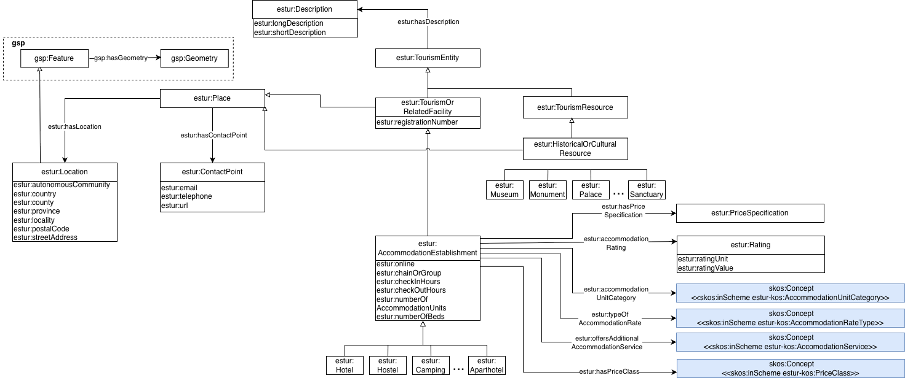
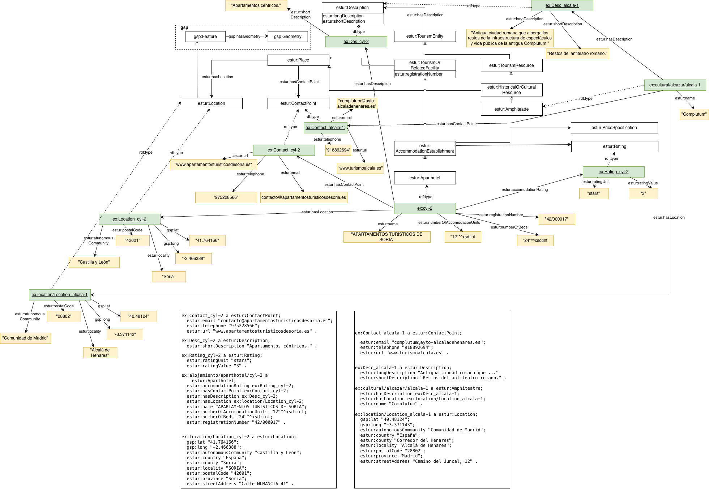

# Ontología EDINT Turismo (EDINT Tourism Ontology)

Este repositorio demuestra cómo se puede reutilizar la ontología de turismo que se está desarrollando en el contexto del espacio de datos de turismo promovido por SEGITTUR. Específicamente, se utilizan en los ejemplos las siguientes clases y propiedades:
## Clase AccomodationEstablishment
Los tipos de alojamiento son subclases: Hotel, Hostal, Hostel, Aparthotel, Vacation Rentals.
### Propiedades:
- accomodationRating (object property) entre AccomodationEstablishment y Rating
- numberOfAccomodationUnits (data property) xsd:int
- numberOfBeds (data property) xsd:int
- registrationNumber es identificador(data property) string
- hasDescription (object property) entre TourismEntity (superclase) y Description
- name (data property) xsd:string
- hasLocation (object property) entre Place (superclase) y Location 
- hasContactPoint (object property) entre Place (superclase) y ContactPoint

## Clase ContactPoint
### Propiedades:
- email (data property) xsd:string
- telephone (data property) xsd:string
- url (data property) xsd:string

## Clase Rating
### Propiedades:
- ratingUnit (data property) xsd:string. por ejemplo "stars"
- ratingValue (data property) xsd:string. por ejemplo "3"

## Clase Description
### Propiedades:
- longDescription (data property) xsd:string
- shortDescription (data property) xsd:string

## Clase Location
### Propiedades:
- autonomousCommunity (data property) xsd:string
- country (data property) xsd:string
- county (data property) xsd:string (comarca)
- province (data property) xsd:string
- locality (data property) xsd:string
- postal code (data property) xsd:string
- street address (data property) xsd:string 
- gsp:lat y gsp:long (subclase de gsp:Feature)

## Clase: HistoricalOrCulturalResource
Los tipos de recurso histórico-cultural son subclases: Alcazar, Amphiteatre, Acueduct, etc.

### Propiedades:
- name (data property) xsd:string
- hasLocation (object property) entre Place (superclase) y Location 
- hasDescription: (object property) entre TourismEntity (superclase) y Description

## Propósito y alcance de la ontología (Purpose and scope of the ontology)

El propósito de esta ontología es el de proporcionar un vocabulario común para la representación de las entidades y datos principales de los alojamientos y puntos de interés turísticos de una entidad local, para que luego se pueda realizar su explotación directamente en algún portal de turismo, o de manera agregada mediante los cubos de datos de turismo que se han definido para EDINT. Su alcance cubre los datos que pueden ser utilizados con los propósitos de conocer y gestionar el turismo dentro de la entidad local, que es parte de las funciones habituales de las entidades locales.

## Prefijo y espacio de nombres (Prefix and namespace)

El prefijo de esta ontología es `estur` y se publica bajo el espacio de nombres https://ontologia.segittur.es/turismo/def/core#

## Estructura del repositorio (Repository structure)

El repositorio contiene las siguientes carpetas

| Carpeta | Descripción |
|--------|--------------|
| **examples/** | Contiene las fuentes de datos y los ejemplos en RDF generados con la ontología a partir de estas fuentes. |
| **mappings/** | Contiene los ficheros de los mappings (reglas de correspondencia) utilizados para generar los ejemplos en RDF.  |

## Diagrama conceptual y Diagrama con ejemplo para Turismo (Tourism conceptual diagram and examples diagram)
### Porción del diagrama conceptual de la Ontología de Turismo del espacio de datos de turismo promovido por SEGITTUR 

Este diagrama contiene las clases, propiedades de datos y propiedades de objeto (relaciones entre clases) de la Ontología de Turismo de SEGITTUR que se han identificado para ser reutilizadas en el dominio de turismo para ciudades. Uno de los conceptos centrales es  `estur:AccomodationEstablishment` (establecimiento para alojamiento), que se relaciona con otras clases a través de sus superclases tales como  `estur:ContactPoint`y `estur:Location` (al ser subclase de `estur:Place`). La clase `estur:Location` representa la ubicación del alojamiento especificada a través de su latitud, longitud, país, provincia, localidad, código postal y dirección.

También se relaciona con `estur:Description` (al ser subclase de`estur:TourismEntity`) . La clase se relaciona con `estur:Rating` para indicar la clasificación del establecimiento en alguna unidad de medida, por ejemplo "Estrellas" y con `estur:PriceSpecification`(especificación del precio). Además tiene propiedades que se relacionan con taxonomías SKOS: `estur-kos:AccomodationCategory`(categoría de alojamiento), `estur-kos:typeOfAccomodationRate`(tipo de tarifa de alojamiento), `estur-kos:OffersAdditionalAccomodationService`(ofrece servicio adicional) y `estur:PriceClass`(categoría de precio).

Un concepto relevante para el turismo de ciudades es el de `estur:HistoricalOrCulturalResource`(recurso histórico o cultural) que comprende los museos, monumentos, santuarios, entre otros. Es subclase de `estur:Place` por lo cual se relaciona con `estur:ContactPoint` y con `estur:Location` y también se representa su `estur:Description`al ser un tipo de `estur:TourismEntity`.

### Ejemplo de utilización de los conceptos de la Ontología de Turismo SEGITTUR  

Este ejemplo ilustra la utilización de la Ontología de Turismo SEGITTUR para el dominio de turismo de ciudades. Se tiene un `estur:AccomodationEstablishment` (establecimiento) con identificador "cyl-2" que se relaciona con su contacto, descripción, ubicación y clasificación. Para cada instancia también se representan sus propiedades de datos. En el diagrama se representa también la instancia de `estur:HistoricalOrCulturalResource` (recurso histórico o cultural) que es un anfiteatro situado en Alcalá de Henares con nombre "Complutum".

## Mantenimiento y evolución (Maintenance and evolution)

Para manejar las incidencias o mejoras sugeridas con respecto a la ontología, recomendamos seguir las guías proporcionadas en ([Issues Management](./ISSUES.md)) para generar una incidencia.

## Financiación (Funding)

Los ejemplos aportados para el uso de esta ontología han sido desarrollados en el contexto del Espacio de Datos para las Infraestructuras Urbanas Inteligentes ([EDINT](https://edint.es)). El desarrollo de la ontología se está realizando en el contexto del espacio de datos de turismo anteriormente mencionado.

